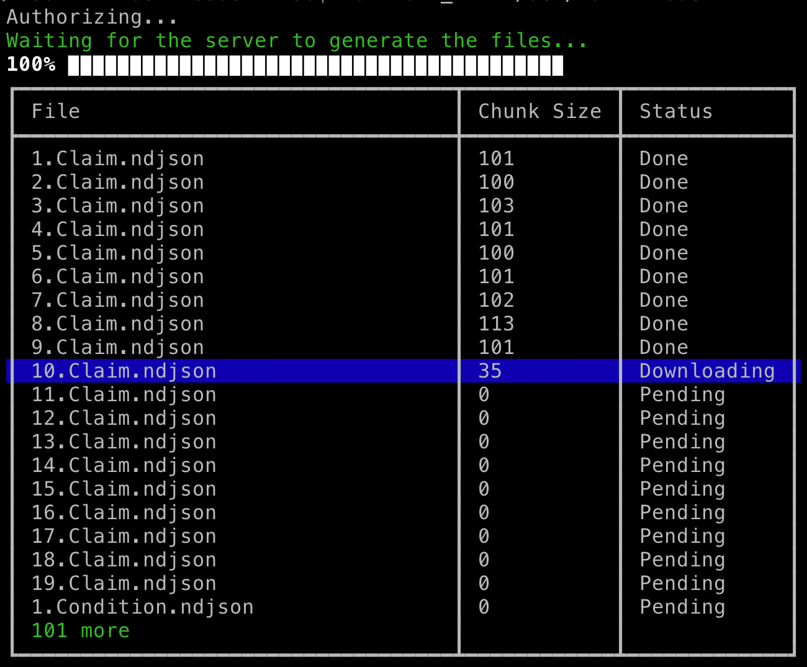

# Example FHIR Downloader (Backend Service/Bulk Data) App

This is a sample CLI app that demonstrates how to implement the spec from https://github.com/smart-on-fhir/fhir-bulk-data-docs/blob/master/README.md.

## Screenshot


## Install

First you have to install NodeJS if you don't already have it from https://nodejs.org/. This app has been developed on Node version 7.9 and also tested on Node 8. In case you have older version you might need to also install a newer one. This is easy to do using the Node Version Manager from https://github.com/creationix/nvm. Then clone the code and install the dependencies:
```sh
git clone https://github.com/smart-on-fhir/sample-apps-stu3.git
cd sample-apps-stu3/fhir-downloader
npm i
```

## Run
```sh
node . -d /dev/null
```

## Configuration

The most common options are available as CLI arguments. However, if you want to use this with protected servers using the backend services auth, there are some settings that are loaded from a config file called `config.json` in the project root folder. This file is not required but we have included an example configuration in `config.example.json` that you can just rename. The options that can be defined there are:
- `fhir_url`    - Required. Can be overridden by the `-f` or `--fhir-url` parameter
- `jwks`        - Optional. An array of JWK keys (must contain a public/private key pair).
- `client_id`   - Optional. The client ID obtained at registration. If omitted, no authentication will be performed and all the settings except `fhir_url` will be ignored.
- `token_url`   - Optional. Required if `client_id` is set. The authentication endpoint.
- `jwks_url`    - Optional. If this is a local URL (at `localhost`, `127.0.0.1` or `0.0.0.0`), a server will be started there to host the public keys
                  from the `jwks`. In this case `jwks` is required. If this is remote URL, no server will be started and `jwks` is not required.

Tools like https://bulk-data.smarthealthit.org/ can generate such a config file and you can just download and use it (note the "Download as JSON" button). For more details check out the backend services spec at http://docs.smarthealthit.org/authorization/backend-services/.


## Options

- `-V, --version`         - output the version number
- `-f, --fhir-url [url]`  - FHIR server URL. Defaults to the `fhir_url` option from the config file (if any)
- `-T, --type [list]`     - Zero or more resource types to download. If omitted downloads everything
- `-s, --start [date]`    - Only include resources modified after this date
- `-g, --group [id]`      - Group ID - only include resources that belong to this group
- `-d, --dir [directory]` - Download destination (default:`./downloads`)
- `-p, --proxy [url]`     - Proxy server if needed
- `--global`              - Global (system-level) export
- `--no-gzip`             - Do not request GZipped files
- `-h, --help`            - output usage information

## Validating References
There is a helper script in the root folder called `test-references.js`. It will walk all the `.ndjson`
files in the `downloads` folder and insert all resources into an SQLite database. Then it will walk all the resources
in that database and check if any references can be resolved to another resource in the same DB.
You can use it like so:

Example Config:
```json
{
    "jwks_url": "https://cdn.rawgit.com/smart-on-fhir/fhir-bulk-data-docs/master/sample-jwks/RS384.public.json",
    "fhir_url": "https://bulk-data.smarthealthit.org/eyJlcnIiOiIiLCJwYWdlIjoxMDAwMCwiZHVyIjoxMCwidGx0IjoxNSwibSI6MX0/fhir"
}
```
Then run:
```sh
rm -f downloads/*.ndjson && node . --global && node test-references.js
```
